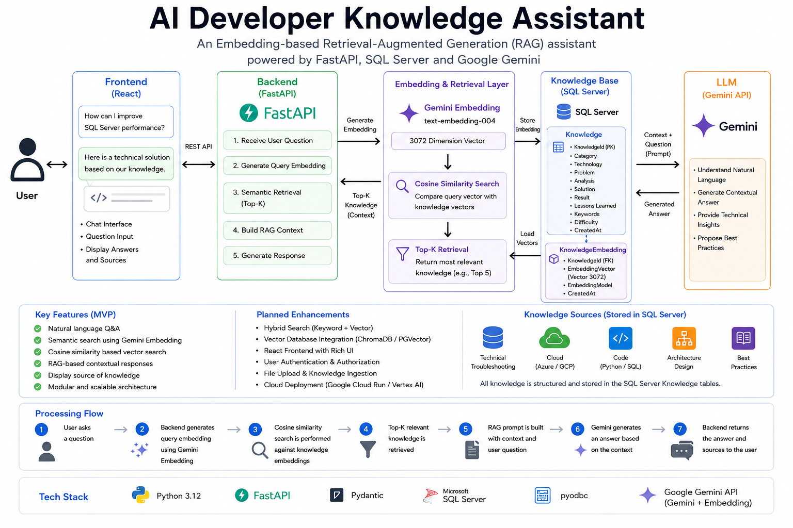

# AI Developer Knowledge Assistant

A Retrieval-Augmented Generation (RAG) based AI assistant that retrieves engineering knowledge from a SQL Server knowledge base and generates contextual answers using the Google Gemini API.

This project demonstrates modern AI application development using FastAPI, SQL Server, vector embeddings, semantic retrieval, and Large Language Models (LLMs).

The goal of this project is to build an AI assistant that helps developers retrieve technical knowledge, troubleshoot issues, and support engineering decision making.

---

# Architecture



The system follows a Retrieval-Augmented Generation (RAG) architecture.

```text
User Question
      |
      v
FastAPI Backend
      |
      v
RAG Service
      |
      +----------------+
      |                |
      v                v
Question          Knowledge
Embedding         Retrieval
      |                |
      v                v
Similarity Search <----+
      |
      v
Relevant Knowledge Context
      |
      v
Prompt Construction
      |
      v
Google Gemini API
      |
      v
Generated Answer
```

The system stores structured engineering knowledge in SQL Server.

When a user submits a question:

1. The question is converted into an embedding vector.
2. Similar knowledge records are retrieved using vector similarity.
3. Retrieved knowledge is formatted as context.
4. Google Gemini generates an answer based on the retrieved information.

---

# 🚀 Current Features

* ✅ FastAPI backend
* ✅ REST API
* ✅ Google Gemini API integration
* ✅ Gemini Embedding integration
* ✅ SQL Server knowledge base
* ✅ Vector embedding storage
* ✅ Semantic similarity search
* ✅ Retrieval-Augmented Generation (RAG)
* ✅ Context-based answer generation
* ✅ Environment variable management (`.env`)
* ✅ Layered architecture (Services / Repository / Models)

---

# 🛠 Tech Stack

## Backend

* Python 3.12
* FastAPI
* Pydantic
* Uvicorn

## AI

* Google Gemini API
* Gemini Embedding
* Retrieval-Augmented Generation (RAG)
* Semantic Similarity Search

## Database

* SQL Server
* pyodbc
* Vector embedding storage

---

# 🗄 Database Design

The knowledge base is managed using SQL Server.

## Knowledge Table

The `Knowledge` table stores structured engineering knowledge used for AI retrieval.

Knowledge records include:

* Category
* Technology
* Title
* Problem
* Analysis
* Solution
* Result
* Lessons Learned
* Keywords
* Difficulty

The knowledge structure is designed to store not only solutions, but also troubleshooting processes and engineering decision history.

---

## KnowledgeEmbedding Table

The `KnowledgeEmbedding` table stores generated vector embeddings.

These embeddings are used for semantic similarity search during retrieval.

Embedding generation is performed by:

```text
backend/batch/generate_embeddings.py
```

---

# 📂 Project Structure

```text
backend/
│
├── main.py
│
├── batch/
│   └── generate_embeddings.py
│
├── models/
│   └── chat.py
│
├── services/
│   ├── embedding.py
│   ├── gemini.py
│   ├── knowledge_formatter.py
│   ├── rag.py
│   ├── retrieval.py
│   └── similarity.py
│
├── repositories/
│   ├── knowledge_repository.py
│   ├── knowledge_embedding_repository.py
│   └── embedding_repository.py
│
└── database/
    ├── connection.py
    └── schema.sql
```

---

# Layer Responsibility

| Layer        | Responsibility                                |
| ------------ | --------------------------------------------- |
| main.py      | FastAPI API endpoints                         |
| batch        | Batch processing such as embedding generation |
| services     | AI processing, retrieval logic, RAG workflow  |
| repositories | SQL Server data access and persistence        |
| models       | API request / response schemas                |
| database     | Database connection and schema management     |

---

# 🧠 RAG Processing Flow

The assistant generates answers through the following process:

## 1. User Question

The user sends a technical question through the API.

Example:

```text
How can I resolve SQL Server connection timeout issues?
```

---

## 2. Question Embedding

The question is converted into a vector representation using Gemini Embedding.

---

## 3. Semantic Retrieval

The system compares the question vector against stored knowledge embeddings.

The most relevant knowledge records are retrieved.

---

## 4. Context Construction

Retrieved knowledge is formatted into context:

Example:

```text
Title:
SQL Server Connection Timeout Troubleshooting

Problem:
Application cannot connect to database

Analysis:
Network timeout caused by firewall configuration

Solution:
Validate NSG rules and SQL Server listener settings
```

---

## 5. Gemini Generation

The context and user question are sent to Gemini.

Gemini generates a context-aware response based on the retrieved engineering knowledge.

---

# 🔄 Embedding Generation Flow

Knowledge embeddings are generated through batch processing.

```text
Knowledge Table
      |
      v
generate_embeddings.py
      |
      v
Knowledge Formatter
      |
      v
Gemini Embedding API
      |
      v
KnowledgeEmbedding Table
```

This allows the system to perform semantic retrieval instead of traditional keyword matching.

---

# 📖 API Example

## Request

POST `/chat`

```json
{
  "message": "How can I improve SQL Server performance?"
}
```

---

## Response

```json
{
  "answer": "Based on the stored engineering knowledge, the recommended approach is..."
}
```

---

# ⚙️ Setup

## Create Virtual Environment

```bash
python -m venv .venv
```

Activate environment.

### Windows

```bash
.venv\Scripts\activate
```

---

## Install Dependencies

```bash
pip install -r requirements.txt
```

---

## Configure Environment Variables

Create `.env`.

```text
GEMINI_API_KEY=YOUR_API_KEY
```

---

## Configure SQL Server Connection

Update:

```text
backend/database/connection.py
```

---

## Run Application

```bash
uvicorn backend.main:app --reload
```

---

## Open Swagger UI

```
http://127.0.0.1:8000/docs
```

---

# 🗺 Roadmap

## Completed

* [x] FastAPI backend
* [x] Gemini API integration
* [x] SQL Server knowledge management
* [x] Basic RAG implementation
* [x] Gemini Embedding integration
* [x] Semantic similarity retrieval
* [x] Vector embedding storage
* [x] Layered backend architecture

## Future Improvements

* [ ] Top-K retrieval optimization
* [ ] Score threshold based filtering
* [ ] RAG evaluation framework
* [ ] Feedback-based retrieval improvement
* [ ] React frontend
* [ ] Authentication
* [ ] Docker support
* [ ] Google Cloud deployment

---

# 📌 Version

## v0.3.0

Implemented embedding-based semantic retrieval and RAG pipeline using Google Gemini.

---

# 🎯 Future Vision

The goal of this project is to evolve into an AI-powered developer knowledge platform that can:

* Retrieve internal engineering knowledge
* Provide troubleshooting recommendations
* Support architecture decision making
* Improve developer productivity
* Learn from engineering feedback
* Integrate with cloud-native AI platforms
